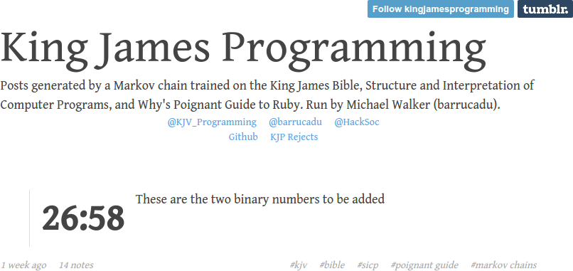
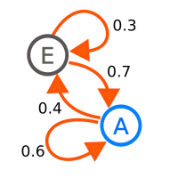
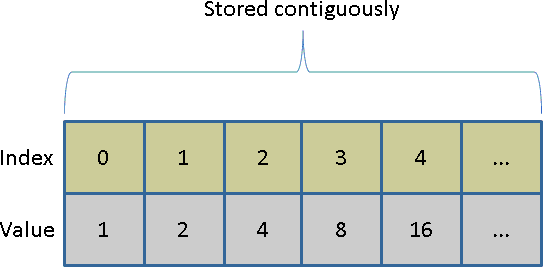
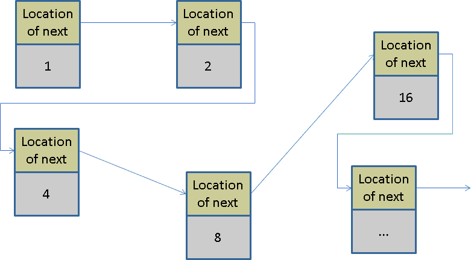
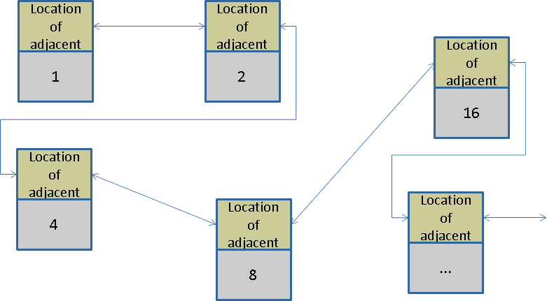

## Contents

* Background
* The ngram Package
* Using the ngram Package
* A Real Analysis Using ngram
* A Little Computer Science
* Other Packages
* Wrapup


# Background

## Motivation

One day, while bored...




## Modeling Human Language

* Bag of words model: *only multiplicity matters*.
* "All models are wrong, ..."
* Beyond a bag of words.
    - grammar
    - word order


## n-gram

* n-gram:
    - *ordered* sequence of "words"
    - taken n at a time
    - contiguous
* "words"
    - letters
    - syllables
    - actual words
* The larger n is, the closer it models the input text (to the point of being useless!).


## Example:  2-grams

*To be or not to be, that is the question.*

* to be
* be or
* or not
* not to
* to be
* ...

## Example:  3-grams

*To be or not to be, that is the question.*

* to be or
* be or not
* or not to
* not to be
* to be that
* ...

## Example:  9-grams

*To be or not to be, that is the question.*

* to be or not to be that is the
* be or not to be that is the question


## Criticisms of n-grams

* Numerous; short version "too simplistic".
* "Colorless green ideas sleep furiously" -- Noam Chomsky
* [*On Chomsky and the Two Cultures of Statistical Learning*](http://norvig.com/chomsky.html), Peter Norvig


## Applications

* Sometimes directly informative.
* [Google Ngram Viewer](https://books.google.com/ngrams)
* Plagiarism detection
* Spell checking
* Genome sequence validation.
* [Fuzzy string searching](http://ntz-develop.blogspot.com/2011/03/fuzzy-string-search.html)
* Language modeling...


## Markov Chains

* Complicated mathematical state model (image courtesy of wikipedia)

* Invented by Andrey Markov to show LLN didn't need independence.
* [DEVELOPED OUT OF SPITE!](http://www.americanscientist.org/issues/pub/first-links-in-the-markov-chain/5)


## n-grams and Markov Chains

* Get all n-grams
* Also get all "next words"
* E.g.: "to be or not to be, that..."
    - to be
        - or
        - that
    - be or
        - not
    - ...

## n-grams and Markov Chains

* Can generate new text with same statistical properties as the old text.
* Just sample!


# The ngram Package

## Revisiting the Crucial Problem

* KJP is open source...nice!
* ...but it's written in Python


## Python?

<b><font size=40 color="red">DISGUSTING</b></font>


## So Obviously


## ngram:  What is it?

* R package.
* Drew Schmidt and Christian Heckendorf.
* High performance n-gram tokenizer and babbler.
* Also builds as a standalone shared library.
* Heavy lifting done in C.


## Shiny App

Hosted:

* https://wrathematics.shinyapps.io/ngram

Source:

* https://github.com/wrathematics/ngram/tree/master/inst/shiny/babbler


## Modern Applied Statistics in R'lyeh

* Combine *Modern Applied Statistcs with S* with the complete works of H. P. Lovecraft.
* Generate nonsense.

```
The original paper gave a linear regression for the square root 
of the area. It is also necessary to account for the phenomenon
itself. What gaseous emanation or mineral vapour could have wrought
this change in so relatively short a time was utterly beyond us.
```

* Win internet points.
* "I'm watching you..." -- Bill Venables
* Original article:  
http://librestats.com/2014/07/01/modern-applied-statistics-in-rlyeh/


## Package Installation

Older version on CRAN

```r
install.packages("ngram")
```


## Installing the Development Version

**Preliminaries:**

* Windows: Install Rtools [https://cran.r-project.org/bin/windows/Rtools/](https://cran.r-project.org/bin/windows/Rtools/)
* Mac: First, you will need to install [XCode](http://itunes.apple.com/us/app/xcode/id497799835?mt=12) from the Mac App Store.  Then, open XCode and choose "Preferences", "Downloads", then "Install Command Line Tools".
* Linux: You're good, bro.

**Installation:**

* With devtools `install_github("wrathematics/ngram")`
* Without: Download and manually install [github.com/wrathematics/ngram/archive/master.zip](https://github.com/wrathematics/ngram/archive/master.zip)


## Warning!

Can't just source the files in `R/`!


# Using the ngram Package

## Preprocessing

`ngram()` expects:

* a single string
* already pre-processed
* "words" are separated by one or more spaces


## Example

```{r}
library(ngram)
x <- "a b a c a b b"
ng <- ngram(x, n=2)
ng
```

## Inspection

```{r}
print(ng, output="full")
```

## Structure

```{r}
str(ng)
```

## Babbling

```{r}
babble(ng, 25)
babble(ng, 25, seed=1234)
```

## Extracting Data

```{r}
get.phrasetable(ng)
```


# A Real Analysis Using ngram

## Alice In Wonderland

* Against Project Gutenberg terms of service to use "automatic" collection.
* So do it by hand.

```{r, echo=FALSE, cache=TRUE}
alice_file <- "https://raw.githubusercontent.com/wrathematics/ngram/master/inst/presentations/2015-oct-7/alice.txt"
```

```{r, cache=TRUE}
## First download http://www.gutenberg.org/cache/epub/11/pg11.txt
alice <- readLines(alice_file)
alice <- alice[31:(length(alice)-366)]
```


## Inspecting the Data

```{r, cache=TRUE}
head(alice)
tail(alice)
```


## Fitting an n-gram Model

```{r}
library(ngram)

alice <- paste0(alice, collapse=" ")
string.summary(alice)
```

```{r}
ng <- ngram(alice, n=2)
ng
```

## Inspection

```{r}
print(ng, output="truncated")
```

## Extract Phrasetable

```{r}
pt <- get.phrasetable(ng)
head(pt)
```

## Extract Phrasetable

```{r}
tail(pt)
```

## Clean and Try Again

```{r, message=FALSE}
library(tm)
corpus <- Corpus(VectorSource(alice))
corpus <- tm_map(corpus, content_transformer(tolower))
corpus <- tm_map(corpus, removePunctuation)
corpus <- tm_map(corpus, removeNumbers)
corpus <- tm_map(corpus, stripWhitespace)

corpus <- tm_map(corpus, removeWords, stopwords("en"))
```

## Remember, a Single String!

```{r}
alice_clean <- corpus[[1]]$content
substr(alice_clean, start=1, stop=200)
```

## Fit a New Model

```{r}
ng <- ngram(alice_clean, n=2)
ng
pt <- get.phrasetable(ng)
head(pt)
```


# A Little Computer Science

## Common Data Structures

* Arrays
* Linked lists
* Deques - double ended queue (also stacks and queues)


## Arrays




## Linked Lists




## Deques




## Data Structures in R

* Array
* List (also an array!)
* Environments (hash table)
* Roll your own (hard!)


## R Lists

Growing a list is expensive.

```{r, cache=TRUE}
n <- 1e5

system.time({
  l1 <- list()
  for (i in 1:n) l1[[i]] <- i
})
```


## Deques

Growing a deque is cheap.

```{r, cache=TRUE}
library(dequer)

system.time({
  dl <- deque()
  for (i in 1:n) pushback(dl, i)
  l2 <- as.list(dl)
})
rev(dl);rm(dl)
```


## Same Destination, Different Path

```{r}
all.equal(l1, l2)
```


## So What's the Deal?

* Arrays are contiguous!
* Want to add a new thing to an array?
    - Allocate new storage.
    - Copy over old storage.
    - Add new thing.
    - Garbage collect old storage.
* Do this a million times...


## Sometimes Better to Not Store Contiguously

* Deques and linked lists are *not* (necessarily) contiguous.
* Insertions/deletions are very cheap ($O(1)$).
* Lookups are expensive ($O(n)$).


## Why Are We Talking About This?

Given a text of `n` words where order matters (not a bag of words), how many n-grams are there (not counting multiplicity)?


## Some Crappy Bounds

Call the number of n-grams $N$ and the number of words $W$.

* $N \geq 1$
* $N \leq W - n + 1$


## Can We Do Better?


## What Do We Do?

* So we really have no idea how many there are...
* How to store them?
* We use a linked list!


# Other Packages

## ngramr

* R package to query the Google Ngram Viewer
* Need to be connected to the internet.
* `install.packages('ngramr')`
* `ngram(c("hacker", "programmer"), year_start = 1950)`


## tau: text analysis utilities

* Facilities for n-grams and more.
* Incorporates some pre-processing with tokenization.
* Much more general than `ngram`...
* Also much slower!


## Benchmarking Against tau

```r
library(tau)
library(ngram)

x <- ngram::rcorpus(100000)

tautime <- system.time(pt1 <- textcnt(x, n=3, split=" ", method="string"))[3]
ngtime <- system.time(pt2 <- ngram(x, n=3))[3]

cat("tau: ", tautime, "\nngram: ", ngtime, "\ntau/ngram: ", tautime/ngtime, "\n")
```

```
## tau:  32.671 
## ngram:  0.078 
## tau/ngram:  418.859 
```


# Wrapup

## Summary

* n-grams are simple, but useful models of human language.
* `ngram` is a high performance R package for constructing n-grams.
* Computers are complicated.


## Exercises

* Install the `ngram` package!
* Re-run the *Alice in Wonderland* analysis with `n=3`. How similar are the top/bottom results in the phrasetable?
* The first 3000 amino acids in the DNA sequence of Saccharomyces cerevisiae are available here  [http://tinyurl.com/p73a8wk](http://tinyurl.com/p73a8wk).  How many 2-grams are there?  3-grams?  What is the ratio of 2-grams to characters?  (Hint:  see `?charsplitter`)


## Thanks!

Questions?
